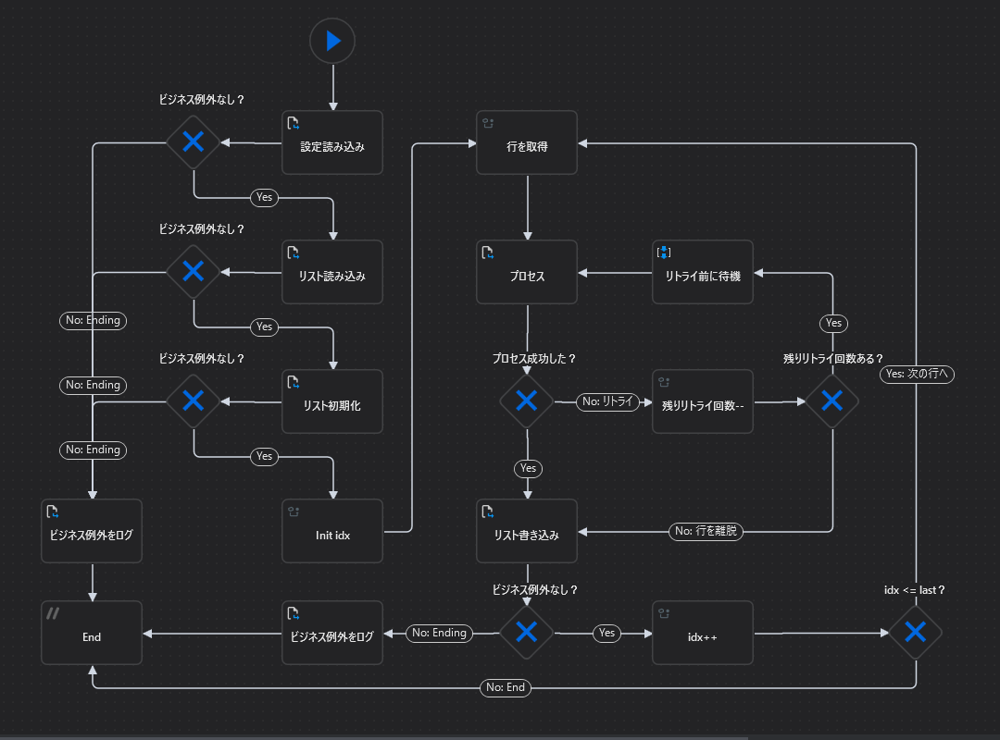

# UiPath-MyFramework

## 機能／概要
* シンプルなフレームワーク。

## 流れ

1. 設定ファイルを読み込む。

1. リストファイルを読み込む。

1. リストを一行ずつ処理する。
    1. データ読み込み
    1. データ書き込み

メインフローチャート図

## 対応しているビジネス例外
* 設定ファイルが読み込めない時
* 必須設定項目がない時 in Name列
* 必須設定項目が空欄の時 in Value列
* リストファイルが読み込めない時
* リストファイルが書き込めない時
* リストファイルにデータ行がない時

## 構成
* Config.xlsx
    * 設定ファイル。

* list.xlsx
    * リストファイル。

* MainChart
    * メインフローチャート。
    * 設定したリトライ回数内で、Processを実行する。
    * リトライ回数内で例外が解決しなかった場合
        * スプレッドシートに例外メッセージを書き込む。
    * ビジネス例外が発生した場合
        * ビジネス例外をログに出力する。
        * 処理を終了する。

* Parts  
    * Process
        * 何らかの処理をするシーケンス。

* Util
    * ListInit  
        * リストを初期化する。

    * ListLoad  
        * リストファイルを読み込む。

    * ListWrite  
        * リストファイルを書き込む。

    * ProcessLog  
        * プロセスID＆ラベル＆メッセージで構成されるログを出力する。

    * ReadConfig  
        * 設定ファイルを読み込む。

## 動作環境
* Windows OS 10 64bit
* UiPath Studio v2024.10.4
